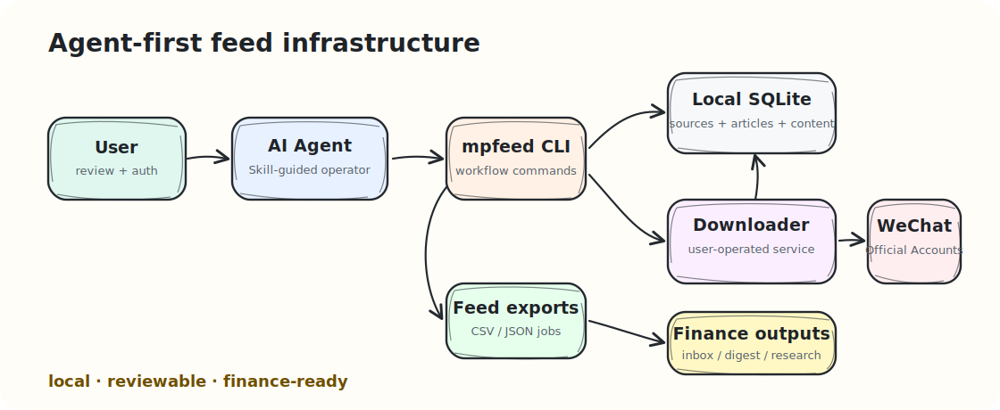
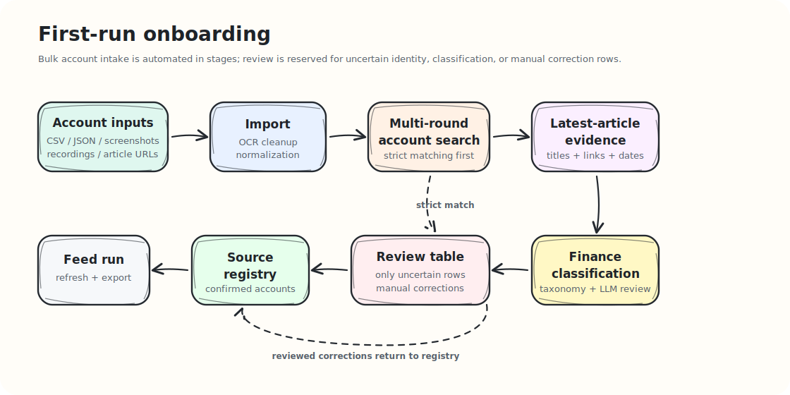

<div align="center">

# wechat-mp-feed

**Agent-first WeChat Official Account feed infrastructure for finance research workflows.**

[中文文档](docs/zh-CN/README.md) · [Agent Skill](skills/wechat-mp-feed/SKILL.md) · [CLI](docs/cli.md) · [Finance Taxonomy](docs/finance-taxonomy.md)

[](https://github.com/szwang-dev/wechat-mp-feed/actions/workflows/ci.yml)
[](LICENSE)
[](https://www.python.org/)
[](.github/workflows/ci.yml)
[](skills/wechat-mp-feed/SKILL.md)

</div>

`wechat-mp-feed` builds a local, reviewable article feed from WeChat Official Accounts. It follows an agent-first operating model with explicit user oversight. Users control local configuration, approve uncertain account identity or classification decisions, and complete downloader authentication when required. Agents orchestrate onboarding, feed refresh, failure inspection, LLM job export, and finance workflow generation through the CLI and skill package.

| area | what it provides |
|---|---|
| Bulk onboarding | Import large account follow lists from CSV/JSON, screenshots, recordings, or article URLs. |
| Review workflow | Produce account identity, finance classification, and manual-correction review tables. |
| Feed layer | Store reviewed sources, article metadata, content records, image positions, classifications, and digests in SQLite. |
| Agent interface | Ship a canonical `SKILL.md` package and `mpfeed` CLI commands for agent systems. |
| Finance layer | Add taxonomy, scoring, low-signal filtering, and downstream inbox/digest building blocks. |

Core workflow:

- Onboard large Official Account follow lists from CSV/JSON, screenshots, recordings, or article URLs.
- Search and resolve imported accounts through a user-operated downloader service.
- Generate review tables for account identity, finance classification, and manual corrections.
- Promote reviewed or strict-matched accounts into the source registry.
- Store confirmed sources, article metadata, content records, images, classifications, and digests in local SQLite.
- Refresh article lists and fetch retained article content with conservative retry and rate-limit handling.
- Export reviewable feed files:
  - `feed-items.csv/json`
  - `feed-summary.json/csv`
  - `feed-failures.csv/json`

The package also includes a finance taxonomy pack for source classification, article scoring, and downstream research inbox or digest workflows.

WeChat access is handled by a downloader service that you run and authenticate. `wechat-mp-feed` talks to that service through a configured base URL.

First-run onboarding is built for hundreds or thousands of accounts. Agents execute OCR/import, multi-round search, latest-article evidence collection, LLM-assisted finance classification, and review export as a staged workflow. Human review is concentrated on unresolved account identity, low-confidence classification, and manual correction rows.

## How It Works



First-run onboarding:



## Agent Skill

The canonical agent skill lives in:

```text
skills/wechat-mp-feed/
```

Give this folder to an agent system that supports `SKILL.md`, or register [SKILL.md](skills/wechat-mp-feed/SKILL.md) as the agent's workflow instruction document.

The skill tells an agent how to:

- run `mpfeed run agent-smoke` and verify the integration;
- run first-time onboarding for large account lists;
- run `mpfeed run feed --config`;
- inspect `feed-summary` and `feed-failures`;
- export article-level LLM jobs;
- keep private account lists, recordings, credentials, databases, and digests outside the public repository;
- build a finance research inbox or digest from feed outputs.

See [Agent skill package](docs/agent-skills.md).

## Quick Start: Offline Demo

The offline demo uses synthetic data and does not require WeChat authentication.

```bash
PYTHONPATH=packages/wechat_mp_feed/src python3 -m wechat_mp_feed.cli \
  --db ./work/demo-feed.sqlite \
  demo seed-feed \
  --work-dir ./work/demo-feed

PYTHONPATH=packages/wechat_mp_feed/src python3 -m wechat_mp_feed.cli \
  run feed \
  --config ./work/demo-feed/feed-config.demo.json
```

The demo writes:

```text
work/demo-feed/feed-items.csv
work/demo-feed/feed-summary.json
work/demo-feed/feed-failures.csv
```

The demo includes a core macro source, an industry research source, a recruiting/low-signal source, and a failed-content example for inspecting the feed shape without private data.

## Install

Editable local install:

```bash
cd packages/wechat_mp_feed
python3 -m pip install -e .
```

Then use:

```bash
mpfeed --help
```

Without installing, run from the repository root:

```bash
PYTHONPATH=packages/wechat_mp_feed/src python3 -m wechat_mp_feed.cli --help
```

Install OCR/video extras only when you need screenshot or recording import:

```bash
python3 -m pip install -e "packages/wechat_mp_feed[ocr]"
```

The default install keeps the core feed layer lightweight.

## Platform Support

The core feed layer is designed for macOS, Linux, and Windows. It uses Python, SQLite, local files, and HTTP adapters; CI runs the unit tests, offline demo, and agent validation fixture on all three operating systems.

Optional components have extra environment needs:

- Downloader services are user-operated. Docker or WSL is usually the easiest path on Windows.
- OCR/video onboarding depends on `ffmpeg` and PaddleOCR. Local installation can work, but Docker/WSL is recommended for reproducible setup.
- The shell bootstrap script is Unix-oriented. Windows users can use WSL, Git Bash, Docker, or configure `WECHAT_DOWNLOAD_API_BASE_URL` directly.

## Feed Workflow

1. Start or configure a downloader service.

```bash
./scripts/bootstrap_wechat_download_api.sh
```

Open the login URL, scan the WeChat QR code, then verify:

```bash
export WECHAT_DOWNLOAD_API_BASE_URL=http://127.0.0.1:5000

PYTHONPATH=packages/wechat_mp_feed/src python3 -m wechat_mp_feed.cli doctor --db ./data/mpfeed.sqlite
PYTHONPATH=packages/wechat_mp_feed/src python3 -m wechat_mp_feed.cli adapter wechat-download-api auth-status
```

2. Import account names.

```bash
PYTHONPATH=packages/wechat_mp_feed/src python3 -m wechat_mp_feed.cli \
  --db ./data/mpfeed.sqlite \
  import csv examples/accounts.csv \
  --name-column name
```

3. Resolve accounts and review matches.

```bash
PYTHONPATH=packages/wechat_mp_feed/src python3 -m wechat_mp_feed.cli \
  --db ./data/mpfeed.sqlite \
  resolve imports \
  --source-type csv \
  --limit 100

PYTHONPATH=packages/wechat_mp_feed/src python3 -m wechat_mp_feed.cli \
  --db ./data/mpfeed.sqlite \
  export candidates \
  --format csv > ./work/candidates.csv
```

Accept or reject candidates after review:

```bash
PYTHONPATH=packages/wechat_mp_feed/src python3 -m wechat_mp_feed.cli \
  --db ./data/mpfeed.sqlite \
  review accept <candidate_id> \
  --tier core
```

4. Run the feed.

Copy and edit the config:

```bash
cp examples/feed-config.example.json ./work/feed-config.json
```

Then run:

```bash
PYTHONPATH=packages/wechat_mp_feed/src python3 -m wechat_mp_feed.cli \
  run feed \
  --config ./work/feed-config.json
```

The feed command refreshes article metadata, runs initial scoring, fetches retained content, exports feed rows, and writes a failure table with `fetch_error` values.

## Config Files

Main feed example:

```text
examples/feed-config.example.json
```

Feed config reference:

```text
docs/config.md
docs/zh-CN/config.md
```

Finance taxonomy:

```text
examples/taxonomy.finance.yaml
```

Synthetic finance classification example seeds:

```text
examples/source_classification_reference.finance.json
```

General draft config:

```text
examples/config.example.yaml
```

## Finance Pack

The finance pack adds source tiers, research domains, and source attributes on top of the generic feed pipeline:

```text
inclusion_tier + primary_domain + source_attribute
```

Examples:

- `core_finance` + `macro_policy` + `sell_side`
- `finance_related` + `quant` + `product_provider`
- `finance_related` + `recruiting_career` + `recruiting`

Use it to separate core finance sources, lower-priority finance-adjacent sources, recruiting/career channels, media, sell-side research, product providers, and independent research accounts.

## Finance Applications

The feed layer is the data foundation for finance workflows. The next layer can use source classifications, article metadata, retained content, image positions, failure status, and article LLM jobs to build:

- research inboxes by domain, source tier, and importance score;
- daily or weekly financial digests;
- topic monitoring for policy, macro, strategy, fixed income, quant, industries, and companies;
- low-signal filtering for recruiting, events, marketing, and repeated market wrap;
- feedback loops that tune taxonomy labels, scoring thresholds, and digest prompts over time.

Reference files:

- [Finance taxonomy](docs/finance-taxonomy.md)
- [Architecture](docs/architecture.md)
- [Feed config](docs/config.md)
- [Agent skill package](docs/agent-skills.md)
- [CLI reference](docs/cli.md)
- [Storage schema](docs/schema.md)

## Local Data And Privacy

`wechat-mp-feed` stores operational data locally. Real account lists, screenshots or recordings, downloader credentials, article archives, SQLite databases, generated feed files, and personal digests should live in user-controlled local paths such as `work/`, `data/`, or a private directory outside the checkout.

Recommended environment overrides for real deployments:

```bash
export WECHAT_MP_FEED_HOME=/path/to/private/mpfeed
export WECHAT_MP_FEED_DB=/path/to/private/mpfeed.sqlite
export WECHAT_DOWNLOAD_API_BASE_URL=http://127.0.0.1:5000
```

## Development

Run tests:

```bash
.venv/bin/python -m unittest packages.wechat_mp_feed.tests.test_mvp packages.wechat_mp_feed.tests.test_taxonomy_file
```

## License

Licensed under the Apache License, Version 2.0.

Copyright 2026 szwang.
