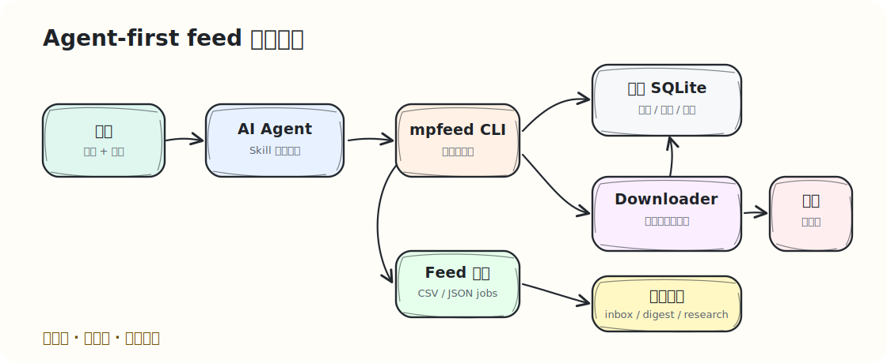
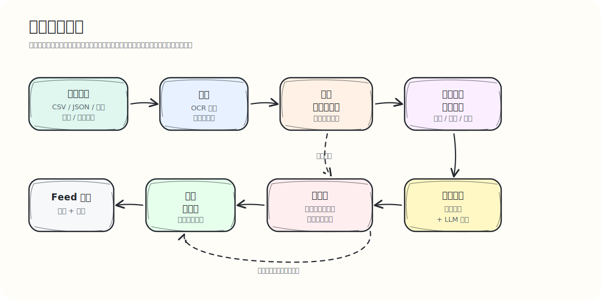

# wechat-mp-feed 中文说明

`wechat-mp-feed` 用于构建本地、可审核的微信公众号文章流。

这个项目采用 agent-first 的运行模式，并保留明确的用户监督边界。用户控制本地配置、确认不确定的账号身份或分类结果，并在 downloader 需要认证时完成扫码。agent 通过 CLI 和 Skill 编排首次接入、feed 刷新、失败检查、LLM jobs 导出和金融投研工作流生成。

核心流程：

- 批量接入 CSV/JSON、截图、录屏或文章链接中的公众号关注列表。
- 搜索并解析用户自行运行的 downloader 服务返回的公众号候选。
- 生成账号身份、金融分类和人工修正审核表。
- 将已审核或严格匹配的账号写入正式来源库。
- 在 SQLite 中保存来源、文章元数据、正文、图片位置、分类和 digest。
- 刷新文章列表，并按评分决定保存层级：`metadata`、`content`、`full_archive`。
- 导出可检查的 feed 文件：
  - `feed-items.csv/json`
  - `feed-summary.json/csv`
  - `feed-failures.csv/json`

项目内置金融增强层，用于公众号来源分类、文章初筛、重要性评分，以及后续投研 inbox / digest 工作流。

微信访问由用户自行运行并登录的 downloader 服务处理。`wechat-mp-feed` 通过配置好的 base URL 调用该服务。

首次接入面向几百到几千个公众号。agent 分阶段执行 OCR/导入、多轮搜索、最新文章证据抓取、LLM 辅助金融分类和审核表导出；人工审核集中在账号身份未解析、分类置信度不足或需要人工修正的行。

## 工作方式



首次批量接入：



## Agent Skill

正式 Skill 包位于：

```text
skills/wechat-mp-feed/
```

支持 `SKILL.md` 的 agent 系统可以直接注册这个目录；其他系统可以把 [SKILL.md](../../skills/wechat-mp-feed/SKILL.md) 作为工作流说明注册给 agent。

Skill 会告诉 agent 如何：

- 运行 `mpfeed run agent-smoke` 验证集成；
- 批量接入首次公众号关注列表；
- 运行 `mpfeed run feed --config`；
- 读取 `feed-summary` 和 `feed-failures`；
- 导出文章级 LLM jobs；
- 把公众号名单、录屏、登录凭据、数据库和 digest 保存在用户私有路径；
- 基于 feed 输出构建金融研究 inbox / digest。

详见 [Agent Skill 包](agent-skills.md)。

## 离线 Demo

离线 demo 使用合成示例数据，不需要微信认证即可在本地生成 feed 示例输出。

```bash
PYTHONPATH=packages/wechat_mp_feed/src python3 -m wechat_mp_feed.cli \
  --db ./work/demo-feed.sqlite \
  demo seed-feed \
  --work-dir ./work/demo-feed

PYTHONPATH=packages/wechat_mp_feed/src python3 -m wechat_mp_feed.cli \
  run feed \
  --config ./work/demo-feed/feed-config.demo.json
```

输出：

```text
work/demo-feed/feed-items.csv
work/demo-feed/feed-summary.json
work/demo-feed/feed-failures.csv
```

这个 demo 包含核心金融、金融相关、招聘低信号和正文失败样例，用于了解 feed 层输出形态。

## 安装

本地开发安装：

```bash
cd packages/wechat_mp_feed
python3 -m pip install -e .
```

也可以从仓库根目录使用源码路径运行：

```bash
PYTHONPATH=packages/wechat_mp_feed/src python3 -m wechat_mp_feed.cli --help
```

需要截图或录屏导入时，再安装 OCR/视频依赖：

```bash
python3 -m pip install -e "packages/wechat_mp_feed[ocr]"
```

## 平台支持

核心 feed 层面向 macOS、Linux 和 Windows。它主要使用 Python、SQLite、本地文件和 HTTP adapter；CI 会在三个系统上运行单元测试、离线 demo 和 agent smoke fixture。

可选组件对环境有额外要求：

- downloader 服务由用户自行运行。Windows 上通常推荐 Docker 或 WSL。
- OCR/录屏导入依赖 `ffmpeg` 和 PaddleOCR，本地安装可行，但 Docker/WSL 更容易复现。
- bootstrap shell 脚本偏 Unix 环境。Windows 用户可以使用 WSL、Git Bash、Docker，或直接配置 `WECHAT_DOWNLOAD_API_BASE_URL`。

## Feed 工作流

启动或配置外部 downloader 服务：

```bash
./scripts/bootstrap_wechat_download_api.sh
```

扫码登录后验证：

```bash
export WECHAT_DOWNLOAD_API_BASE_URL=http://127.0.0.1:5000

PYTHONPATH=packages/wechat_mp_feed/src python3 -m wechat_mp_feed.cli doctor --db ./data/mpfeed.sqlite
PYTHONPATH=packages/wechat_mp_feed/src python3 -m wechat_mp_feed.cli adapter wechat-download-api auth-status
```

导入账号：

```bash
PYTHONPATH=packages/wechat_mp_feed/src python3 -m wechat_mp_feed.cli \
  --db ./data/mpfeed.sqlite \
  import csv examples/accounts.csv \
  --name-column name
```

搜索候选：

```bash
PYTHONPATH=packages/wechat_mp_feed/src python3 -m wechat_mp_feed.cli \
  --db ./data/mpfeed.sqlite \
  resolve imports \
  --source-type csv \
  --limit 100
```

导出候选审核表：

```bash
PYTHONPATH=packages/wechat_mp_feed/src python3 -m wechat_mp_feed.cli \
  --db ./data/mpfeed.sqlite \
  export candidates \
  --format csv > ./work/candidates.csv
```

确认候选后运行 feed：

```bash
cp examples/feed-config.example.json ./work/feed-config.json

PYTHONPATH=packages/wechat_mp_feed/src python3 -m wechat_mp_feed.cli \
  run feed \
  --config ./work/feed-config.json
```

## 金融增强层

金融增强层采用：

```text
inclusion_tier + primary_domain + source_attribute
```

例子：

- `core_finance` + `macro_policy` + `sell_side`
- `finance_related` + `quant` + `product_provider`
- `finance_related` + `recruiting_career` + `recruiting`

## 金融应用拓展

Feed 层是金融工作流的数据基础。后续金融增强层可以利用来源分类、文章元数据、正文、图片位置、失败状态和文章级 LLM jobs 构建：

- 按研究领域、来源层级、重要性分数组织的研究 inbox；
- 每日或每周金融 digest；
- 政策、宏观、策略、固收、金工、行业和公司的专题监控；
- 对招聘、活动、营销、重复市场综述等低信号内容的过滤；
- 基于用户反馈持续调整 taxonomy、评分阈值和 digest prompt。

金融分类体系详见：

- [金融分类体系](finance-taxonomy.md)
- [Feed 配置说明](config.md)
- [Agent Skill 包](agent-skills.md)
- [CLI 参考](cli.md)
- [存储 Schema](schema.md)
- [架构设计](architecture.md)

## 本地数据与隐私

`wechat-mp-feed` 默认把运行数据保存在本地。真实公众号名单、截图或录屏、downloader 登录凭据、原始文章归档、SQLite 数据库、生成的 feed 文件和个人 digest，建议放在用户自己控制的本地路径中，例如 `work/`、`data/`，或仓库目录之外的私有目录。

真实部署时推荐用环境变量指定私有路径：

```bash
export WECHAT_MP_FEED_HOME=/path/to/private/mpfeed
export WECHAT_MP_FEED_DB=/path/to/private/mpfeed.sqlite
export WECHAT_DOWNLOAD_API_BASE_URL=http://127.0.0.1:5000
```

## License

本项目使用 Apache License, Version 2.0。

Copyright 2026 szwang.
