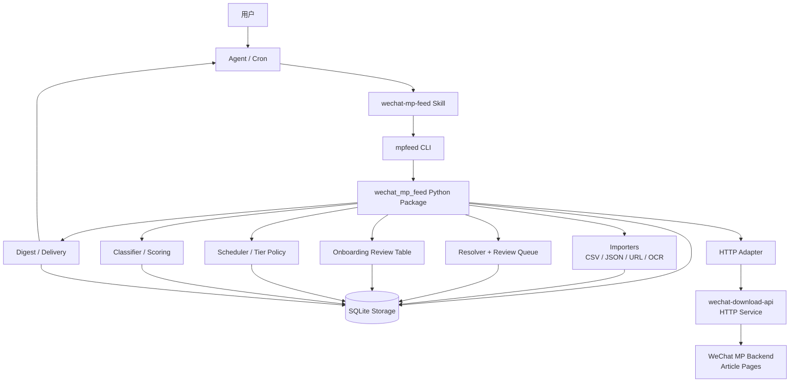
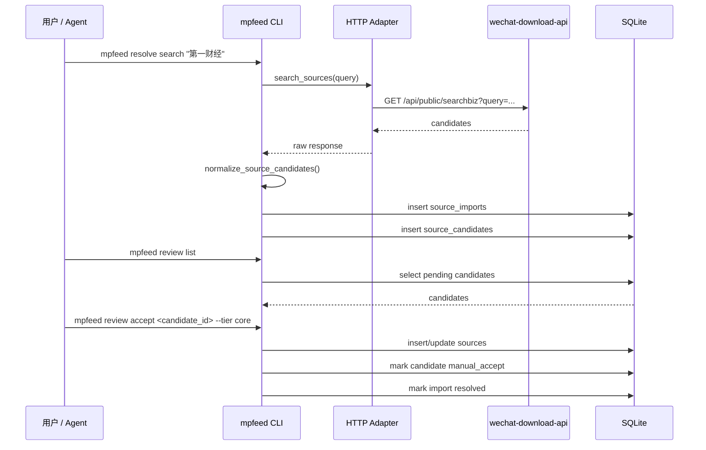
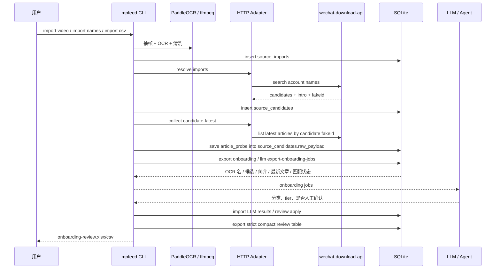
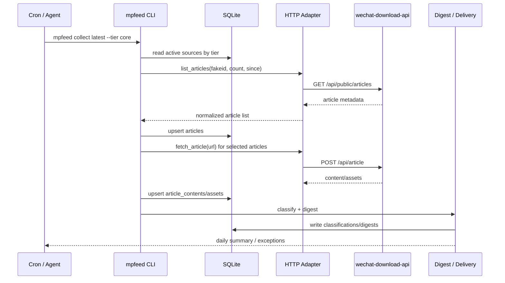
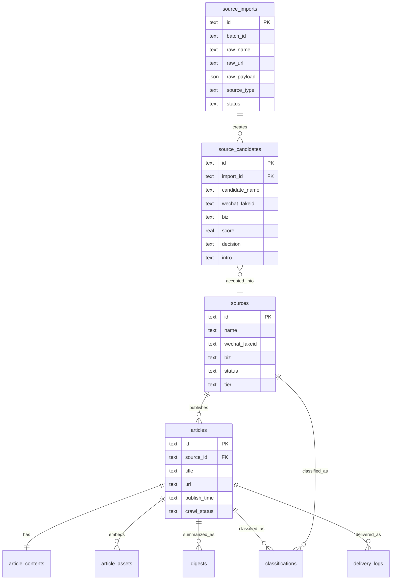
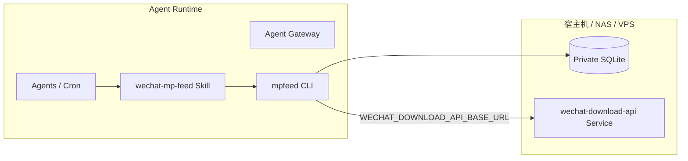

# 架构设计

`wechat-mp-feed` 的核心定位是微信公众号长期跟踪的编排层。它通过 HTTP adapter 调用常驻下载服务，再把结果沉淀为可审核、可调度、可摘要的本地 feed 数据。

## 总览图

## 模块职责

| 模块 | 职责 |
|---|---|
| Agent skill | 告诉 agent 如何安全调用 `mpfeed`，如何检查服务状态，何时请求用户确认 |
| `mpfeed` CLI | 提供可脚本化命令，供用户、cron、agent 调用 |
| Importers | 导入 CSV/JSON 账号、文章 URL、录屏 OCR，保留原始输入 |
| Resolver | 调用 HTTP 服务搜索公众号，把结果写入候选队列 |
| Review Queue | `review list/accept/reject`，把候选晋升到长期来源库 |
| Onboarding Review | 导出首次录入审核表，合并 OCR 名、候选、简介、最新文章、LLM 分类和推荐动作 |
| Source Registry | 保存长期跟踪的公众号来源、fakeid、`__biz`、tier、状态 |
| HTTP Adapter | 通过 base URL 调用外部下载服务 |
| Collector | 从长期来源库拉取文章列表并写入 `articles` |
| Extractor | 获取正文、图片元数据并写入内容表 |
| Rate Limit / Backoff | 按 tier 控制默认来源数、文章数、间隔和重试 |
| Classifier / Digest | 规则版分类、重要性评分、digest；LLM job export/import |

## 数据流：导入与审核

这条链路保证所有长期来源都有来源记录和审核记录；不确定账号进入审核表。

## 数据流：首次录入大批量公众号

首次录入写入顺序：

1. `source_imports`：原始 OCR/list 名称。
2. `source_candidates`：公众号搜索候选。
3. `sources`：人工、规则或 LLM 确认后的长期管理来源。

`export onboarding` 是这条链路的检查点，用于让用户看到每个候选的状态和证据。

当前 strict review 口径：

- `match_type=exact` 表示显示文本完全一致。
- `match_type=normalized` 表示忽略空格、大小写、常见繁简和标点后的规范化一致。
- `similar`、`different`、`unresolved` 不进入 `match账号`，只进入候选账号，并强制人工确认。
- LLM onboarding 可以接受、忽略、拒绝或标记人工确认；重新导入 LLM 结果时，若新判断为忽略/拒绝，会把此前误接纳的关联 source 标记为 `archived`。

## 数据流：长期采集目标

当前已实现 `collect latest` 的文章元数据采集，以及 `collect content` 的正文和图片 URL 元数据提取。视频元数据和更强的内容清洗仍是后续重点。

采集命令会按 `core/normal/long_tail` 使用不同默认策略，避免默认高频抓取。临时 429/5xx 会按 backoff 策略重试。

## 数据库核心表

其中：

- `source_candidates.intro` 保存搜索返回的公众号简介，能辅助来源分类。
- `source_candidates.raw_payload.article_probe` 可保存未接受候选的最新文章探测结果。
- `articles.digest` 保存文章列表里的摘要或描述。
- `article_contents` 保存正文抓取结果；当简介不足以判断时，可以用最新文章标题、摘要或正文帮助 LLM 分类。
- `classifications.method` 区分 `rules_v1`、`llm:<agent>`、`manual`，方便后续覆盖或审计。

## 部署形态

常见 `WECHAT_DOWNLOAD_API_BASE_URL`：

| 场景 | 示例 |
|---|---|
| 本机 agent 调本机服务 | `http://127.0.0.1:3000` |
| 容器内 agent 调宿主机服务 | `http://host.docker.internal:3000` |
| 同一 Docker network | `http://wechat-download-api:3000` |
| NAS/VPS 服务 | `https://mpfeed.example.com` |

## 设计边界

本项目负责：

- 来源库、候选队列和人工审核。
- 调度策略和分层抓取。
- 统一存储。
- 分类、摘要和投递。
- Agent 工作流。

底层下载服务负责：

- 登录态和 cookie。
- 公众号后台相关接口。
- fakeid / `__biz` 获取。
- 历史文章列表和文章内容获取。
- 服务健康状态。

这条边界让 `wechat-mp-feed` 可以替换底层 adapter，并保持核心存储和 feed 逻辑稳定。
